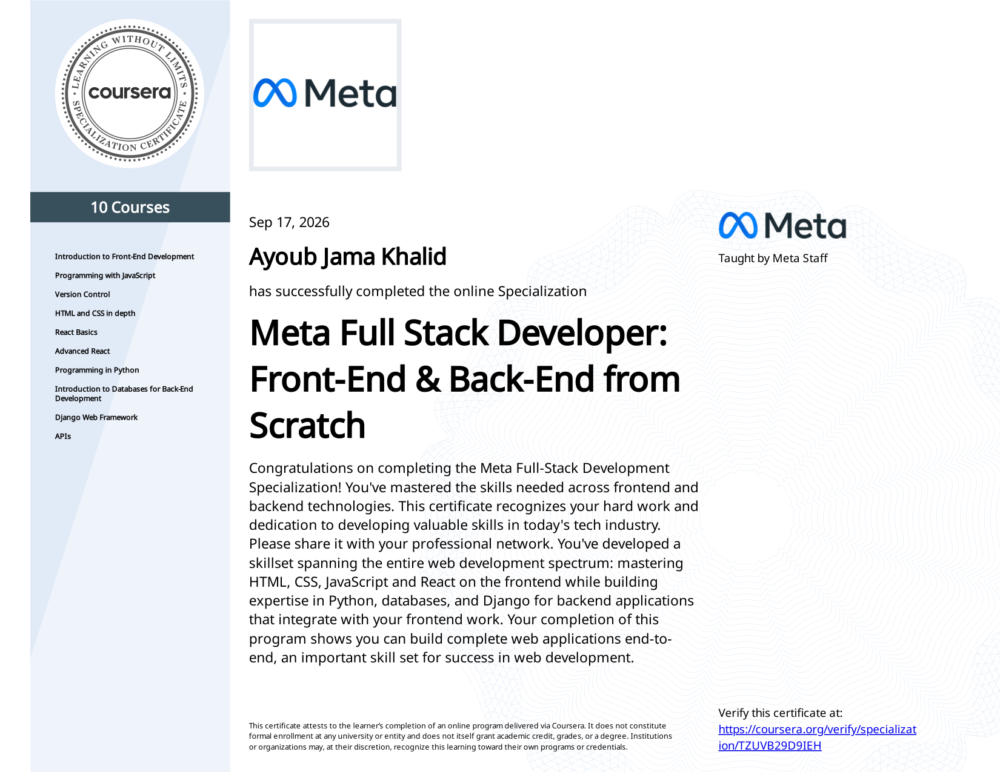
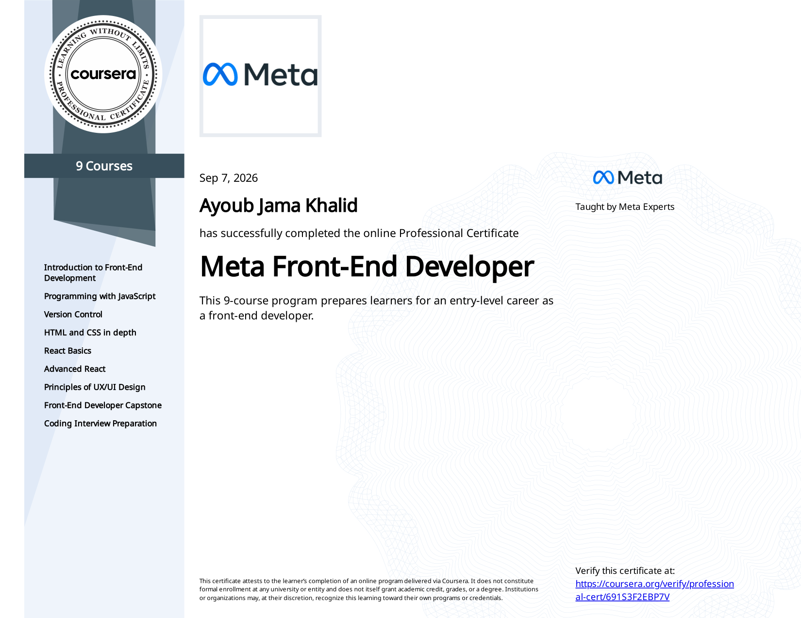

# 🎓 Meta Full Stack Developer Certificate — Ayoub Kilwe

**Verified professional certifications of [Ayoub Jama Khalid (Ayoub Kilwe)](https://ayoubkilwe.dev), Software Engineer.**
Meta Full Stack Developer Specialization · Meta Front-End Developer Professional Certificate · Programming with JavaScript

---

## 🏆 Meta Full Stack Developer: Front-End & Back-End from Scratch

| | |
|:--|:--|
| **Credential** | Meta Full Stack Developer Specialization (10 courses) |
| **Issued by** | Meta, via Coursera |
| **Recipient** | Ayoub Jama Khalid (Ayoub Kilwe) |
| **Completed** | September 17, 2026 |
| **Verify** | [coursera.org/verify/specialization/TZUVB29D9IEH](https://coursera.org/verify/specialization/TZUVB29D9IEH) |
| **PDF** | [meta-full-stack-developer/certificate.pdf](meta-full-stack-developer/certificate.pdf) |

**Courses completed (taught by Meta staff):**

| # | Course | Track |
|:--|:--|:--|
| 1 | Introduction to Front-End Development | Frontend |
| 2 | Programming with JavaScript | Frontend |
| 3 | Version Control | Tooling |
| 4 | HTML and CSS in depth | Frontend |
| 5 | React Basics | Frontend |
| 6 | Advanced React | Frontend |
| 7 | Programming in Python | Backend |
| 8 | Introduction to Databases for Back-End Development | Backend |
| 9 | Django Web Framework | Backend |
| 10 | APIs | Backend |

**Skills validated:** HTML5 · CSS3 · JavaScript (ES6+) · React · Git & GitHub · Python · SQL & database design · Django · REST API design · full-stack application architecture.

---

## 🥈 Meta Front-End Developer Professional Certificate

| | |
|:--|:--|
| **Credential** | Meta Front-End Developer Professional Certificate (9 courses) |
| **Completed** | September 7, 2026 |
| **Verify** | [coursera.org/verify/professional-cert/691S3F2EBP7V](https://coursera.org/verify/professional-cert/691S3F2EBP7V) |
| **PDF** | [meta-front-end-developer/certificate.pdf](meta-front-end-developer/certificate.pdf) |

Courses: Introduction to Front-End Development · Programming with JavaScript · Version Control · HTML and CSS in depth · React Basics · Advanced React · Principles of UX/UI Design · Front-End Developer Capstone · Coding Interview Preparation.

---

## 🥉 Programming with JavaScript (Meta)

| | |
|:--|:--|
| **Credential** | Course certificate, authorized by Meta |
| **Completed** | August 26, 2026 |
| **Verify** | [coursera.org/verify/UO1WSON17KU9](https://coursera.org/verify/UO1WSON17KU9) |
| **PDF** | [programming-with-javascript/certificate.pdf](programming-with-javascript/certificate.pdf) |

---

## 👤 About the recipient

**Ayoub Kilwe** (Ayoub Jama Khalid) is a Software Engineer from Borama, Somaliland, building web, mobile and AI-powered products with React, Next.js, React Native, Flutter, Node.js and .NET.

- 🌐 Portfolio: **[ayoubkilwe.dev](https://ayoubkilwe.dev)**
- 💻 GitHub: [@AyoubKilwe](https://github.com/AyoubKilwe)
- 💼 LinkedIn: [Ayoub Kilwe](https://www.linkedin.com/in/ayoub-kilwe-51b40a390)
- 📫 Email: ayoubkilwe@gmail.com

All certificates can be independently verified on Coursera using the links above. Certificates are the property of the recipient and are published here for professional reference.
